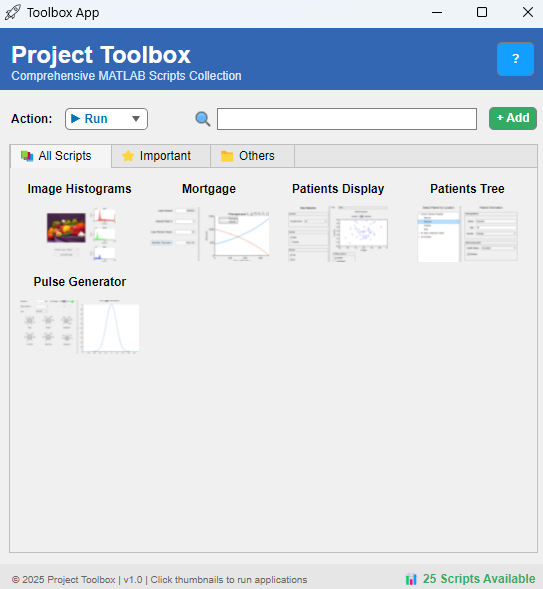

# 🚀 MATLAB Scripts App

**A customizable template for managing your personal MATLAB scripts collection**

[](https://www.mathworks.com/products/matlab.html)

---

## 📋 Overview

MATLAB Scripts App is a **ready-to-use template** that helps you organize and execute your MATLAB scripts through a clean GUI interface. Start with an empty framework and populate it with your own scripts!



---

## ✨ Features

- 🎨 **Empty Template** - Build your personal script library
- 🔍 **Search Functionality** - Find scripts instantly
- ⚡ **One-Click Execution** - Run, open, or view script info
- 📊 **Custom Thumbnails** - Add visual previews
- 🏷️ **Tab Organization** - Categorize scripts (All/Important/Others)
- 📝 **Excel-Based** - Simple configuration via spreadsheet

---

## 🔧 Quick Start

**Prerequisites:** MATLAB R2019b or later

### File Structure
```
matlab-scripts-app/
├── MATLABScriptsApp.mlapp
├── MATLABScriptsApp_exported.m
├── scripts_registry.xlsx
└── Figures/
    ├── AppIcons Dir
    └── [your thumbnails]
```

### Setup Steps

1. **Add your scripts to `scripts_registry.xlsx`:**
   - Click **"+ Add"** button (opens Excel)
   - Add row: ScriptName | Path | About
   - Save and restart App

3. **Add thumbnails (optional):**
   - Create `ScriptName.png` image
   - Place in `Figures/` folder
   - Open MATLABScriptsApp.mlapp and put there Image and label in the grid
   - Right Click on the image -> callback -> ImageClicked

4. **Launch:**
   ```matlab
   MATLABScriptsApp_exported.m
   ```

---

## 📖 Usage

### Running Scripts
1. Select action: **Run** / **Open** / **About**
2. Click script thumbnail

### Search
- Type in search bar
- Click matching script

---

## 🐛 Troubleshooting

| Problem | Solution |
|---------|----------|
| No scripts showing | Add scripts to Excel and restart app |
| File not found | Check script paths are correct |
| Thumbnails missing | Ensure image names match script names |
| Changes not appearing | Always restart app after editing Excel |

---

## 📝 Example Registry

| ScriptName | Path | About |
|------------|------|-------|
| ImageHistogram | C:\Scripts\img_histogram.m | Display RGB histograms |
| DataCleaner | C:\Utils\clean_data.m | Remove outliers |
| FFT_Analysis | D:\DSP\fft_analyzer.m | Frequency analysis |

---

## 📄 License

MIT License - Free to use and modify

---

⭐ **Start organizing your MATLAB scripts today!**
